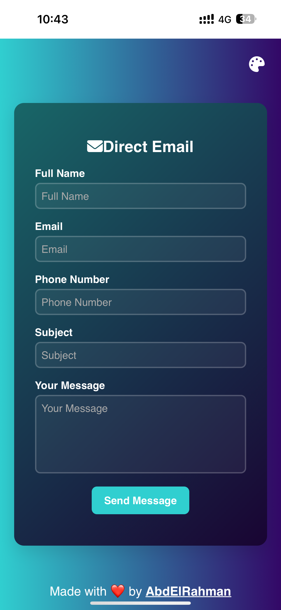
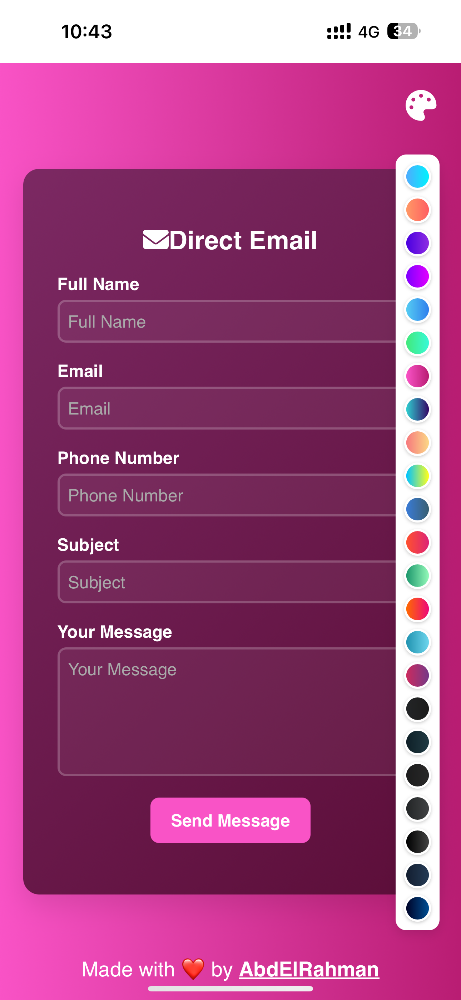

# 📧 Direct Email - Contact Form PWA

**Direct Email** is a sleek, responsive, and theme-customizable contact form built as a Progressive Web App (PWA). It allows users to send messages directly via email using Web3Forms API, with offline support, dynamic theming, and mobile-ready features.

## 🚀 Features

- 🎨 23+ Gradient Theme Switcher (Light & Dark)
- 📨 Send emails securely using Web3Forms API
- 📱 Fully responsive and mobile-friendly
- 🕶️ Supports PWA installation on desktop and mobile
- 🌙 Dark mode & custom background gradients
- 📥 Auto-reset form after submission
- 🧠 Optimized UX with smooth transitions and visual feedback

## 📦 Installation

Clone this repository:

```bash
git clone https://github.com/your-username/direct-email.git
cd direct-email
```


## 🛠️ Setup

1. Replace the `access_key` inside the form with your own from [Web3Forms](https://web3forms.com).
2. Customize styles or logos as needed.
3. Deploy to Netlify, Vercel, GitHub Pages, or your own server.

## 🧪 How to Use

1. Open the web page.
2. Fill in your name, email, phone number, subject, and message.
3. Click **Send Message**.
4. You will get a success message, and the form resets.

## 📸 Screenshots





## 👨‍💻 Author

- **AbdElRahman Hesham**
- 🔗 [abdelrahmanz.netlify.app](https://abdelrahmanz.netlify.app/)

### 📂 Project Structure

```bash
.
├── index.html           # Main page with contact form
├── manifest.json        # PWA manifest
├── service-worker.js    # Caching for offline use
├── favicon.ico          # Icon for browser and PWA
├── images/
│   └── 1.png            # Apple touch icon
├── README.md            # You're here!
```

## 📜 License

MIT License. Feel free to use and modify.

